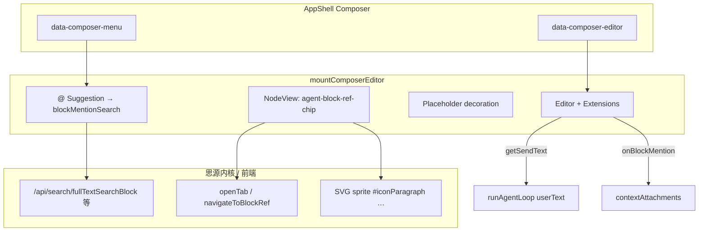

# Composer TipTap 集成

> 文档版本：v1.0  
> 日期：2026-05-28  
> 说明：记录 Agent 插件侧栏 Composer 输入区采用 TipTap（Vanilla）的实现方案，便于后续维护与扩展。

---

## 一、背景与选型

### 1.1 需求

Composer 需要：

- 多行输入、**Undo/Redo**；
- 输入 `@` 时搜索思源块，插入 **内联芯片**（非纯文本）；
- 芯片样式与思源块引用接近，**可点击跳转**；
- 发送给 Agent 时序列化为带 `siyuan://blocks/` 的 Markdown 引用；
- 同步写入 `contextAttachments`，供 `preloadAttachmentPreviews` 预加载块内容。

### 1.2 曾排除的方案

| 方案 | 不采用原因 |
|------|------------|
| `textarea` + 外置附件芯片 | 无内联块引用；`value` 赋值破坏撤销栈 |
| `new Protyle` | 强依赖真实块树与 `/api/transactions`，无 `blockId` 无法临时编辑 |
| Monaco | 体积过大（MB 级），无官方 mention 芯片方案 |
| Lexical + React | 与当前插件（无 React 子树）架构不匹配，生态偏 React |
| Quill | mention + undo 维护风险高 |

### 1.3 当前方案

**TipTap 3 + ProseMirror**，Vanilla 挂载（无 `@tiptap/react`），最小扩展集 + 自定义 **NodeView** 块引用芯片。

---

## 二、依赖（`package.json`）

| 包 | 用途 |
|----|------|
| `@tiptap/core` | 编辑器核心 |
| `@tiptap/pm` | ProseMirror 类型与运行时 |
| `@tiptap/extension-document` | 文档根 |
| `@tiptap/extension-paragraph` | 段落 |
| `@tiptap/extension-text` | 纯文本 |
| `@tiptap/extension-hard-break` | `Shift+Enter` / 换行模式下的软换行 |
| `@tiptap/extension-mention` | `@` 建议与 mention 节点（经扩展为块引用芯片） |
| `@tiptap/suggestion` | `@` 浮层建议（类型由 mention 间接使用） |
| `@tiptap/extensions/placeholder` | 空内容占位符 |
| `@tiptap/extensions/undo-redo` | 撤销 / 重做 |

未引入：`@tiptap/starter-kit`、`@tiptap/react`、Markdown 扩展（发送文本自研序列化）。

生产构建后 `dist/index.js` 约 **480KB+**（含 TipTap + ProseMirror），属预期体积。

---

## 三、源码结构

```
src/ui/composer/
  composerEditor.ts      # 挂载 Editor、快捷键、Placeholder、序列化、建议菜单
  composerBlockRef.ts    # Mention.extend + NodeView 块引用芯片
  blockMentionSearch.ts  # @ 数据源（页签 / searchRefBlock）
  windowTabMentions.ts   # 当前窗口已打开文档页签
  mentionMenuRender.ts   # b3-list-item 风格建议列表
src/siyuan/
  blockIcon.ts           # 块类型 → 思源 SVG symbol（对齐 getIconByType）
  blockNavigation.ts     # 块引用点击跳转（openTab）
src/styles/composer.scss # .agent-composer__pm、芯片、mention 菜单、Placeholder
src/ui/shell/AppShell.ts # mountComposerEditor、contextAttachments 同步
```

### 3.1 挂载入口（`AppShell.ts`）

- DOM：`[data-composer-editor]`（编辑区）、`[data-composer-menu]`（`@` 建议列表）。
- `mountComposerEditor({ editorHost, menuHost, app, kernel, sendKeyMode, onSend, onBlockMention, onBlockMentionRemove })`。
- 发送：`composerEditor.getSendText()` → `runAgentLoop` 的 `userText`。
- 清空：`composerEditor.clear()`。
- 重新生成：`composerEditor.setSendText(lastUser.content)`（当前为纯文本灌入，不解析已有 mention）。

---

## 四、编辑器配置

### 4.1 扩展列表

```text
Document → Paragraph → Text
HardBreak
UndoRedo
Placeholder
ComposerBlockRef（Mention.extend）
```

### 4.2 发送快捷键

逻辑在 `composerEditor.ts` 的 `handleSendKey`，与设置项 `sendKeyMode` 一致：

| 模式 | Enter | Shift+Enter | Ctrl/Cmd+Enter |
|------|--------|-------------|----------------|
| `enter` | 发送 | 换行（`setHardBreak`） | 换行 |
| `ctrlEnter` | 换行 | 换行 | 发送 |

`@` 建议菜单打开时，Enter 用于选中建议，不触发发送。

### 4.3 Placeholder（TipTap 3）

- 扩展通过 **node decoration** 在空 `<p>` 上设置 `is-empty`、`data-placeholder`。
- CSS 在 `.agent-composer__pm` 下：
  - `p.is-empty::before { content: attr(data-placeholder); }`
  - 空文档兜底：`&.is-editor-empty > p:first-child::before` + CSS 变量 `--agent-composer-placeholder`（由 `syncEditorEmptyClass` 写入）。
- **注意**：勿写成 `.agent-composer__pm.is-editor-empty > p`（v3 不会给根节点加 `is-editor-empty`，除非 JS 同步）。

---

## 五、块引用芯片（`composerBlockRef.ts`）

### 5.1 文档模型

- 节点类型仍为 TipTap **`mention`**（`inline` + `atom`）。
- 扩展属性：`id`、`label`、`blockType`、`blockSubtype`（后两者用于图标）。

### 5.2 展示 DOM（NodeView）

```html
<span class="agent-block-ref-chip" contenteditable="false">
  <span class="agent-block-ref-chip__lead" data-action="remove" role="button">
    <span class="agent-block-ref-chip__type"><svg>…块类型图标…</svg></span>
    <span class="agent-block-ref-chip__remove"><svg>#iconClose</svg></span>
  </span>
  <span class="agent-block-ref-chip__ref"
        data-type="block-ref" data-id="块ID" data-subtype="s">锚文本</span>
</span>
```

| 区域 | 行为 |
|------|------|
| 左侧 `__lead` | 显示块类型图标（`getIconByType` + 思源全局 SVG sprite） |
| `__lead` 悬浮 | 类型图标隐藏，显示关闭图标 |
| 点击 `__lead` | 删除 mention 节点，并 `onBlockMentionRemove(blockId)` |
| `__ref` 文案 | 样式对齐思源内联块引用色；点击跳转块 |

### 5.3 垂直对齐

芯片在 `.agent-composer__pm` 内使用 `vertical-align: middle`、`height: 1.5em`（与 `line-height: 1.5` 一致），图标尺寸用 `em`，避免相对光标上偏。

### 5.4 点击跳转

`composerEditor` 的 `handleClick` 识别 `.agent-block-ref-chip__ref`，调用 `navigateToBlockRef`（`src/siyuan/blockNavigation.ts`）：

- 默认：`openTab` + 高亮（`CB_GET_HL` 等，与思源 `checkFold` 语义对齐）；
- Shift：下方分屏；Alt：右侧分屏；Ctrl/Cmd：保留当前光标的新页签打开。

工具 `focus_block` 亦复用 `navigateToBlockRef`。

---

## 六、`@` 块搜索与建议菜单

### 6.1 数据源（`blockMentionSearch.ts`）

| 查询 | 行为 |
|------|------|
| 空（仅 `@`） | `listWindowTabMentions`：`getAllTabs` + `getActiveTab`，**当前聚焦页签排第一** |
| 非空 | `POST /api/search/searchRefBlock`（与思源块引用 hint 相同，非全文搜索） |

返回 `BlockMentionHit`：`id`、`label`、`blockType`、`blockSubtype`、`sub`、`labelHtml`、`source`（`tab` | `search`）。

### 6.2 菜单 UI（`mentionMenuRender.ts`）

- 行结构对齐思源 `genHintItemHTML`：`b3-list-item__first` + `b3-list-item__graphic` + `b3-list-item__text` + `b3-list-item__meta`
- 空查询时显示分组标题「当前窗口」
- 样式见 `composer.scss` 中 `.agent-mention-menu`

---

## 七、发送序列化

`serializeComposerSendText(editor)` 遍历文档：

- 普通文本 → 原文；
- `hardBreak` → `\n`；
- `mention` → `@[label](siyuan://blocks/{id})`（label 中 Markdown 特殊字符转义）。

与 `renderText` 配置一致，供 Agent 与历史消息使用。

---

## 八、上下文附件同步

| 事件 | `contextAttachments` |
|------|----------------------|
| 选中 `@` 建议 | `onBlockMention` → 追加 `kind: "block"` |
| 点击芯片关闭 | `onBlockMentionRemove` → 按 `id` 移除 |
| 发送 | `preloadAttachmentPreviews` 拉取块预览进系统提示 |

芯片与上方 `data-ctx-chips` 条可同时存在；删除芯片会同步去掉附件，但仅删附件不会自动删编辑器内芯片（未做双向强同步）。

---

## 九、参考仓库（`refer/`）

本地离线阅读，**不打包进插件**（`.gitignore` 已忽略）：

```bash
bash scripts/clone-refer.sh
```

其中包含 `refer/tiptap`（[ueberdosis/tiptap](https://github.com/ueberdosis/tiptap) 浅克隆），用于查阅 Mention、Placeholder、Suggestion 等源码。

---

## 十、架构示意



---

## 十一、已知限制与后续可改进

1. **重新生成 / setSendText**：仅灌入纯文本，不还原芯片节点。
2. **文档图标**：`NodeDocument` 的自定义 emoji 图标（`ial.icon`）未在芯片中展示，仅用 `iconFile`。
3. **动态锚文本**：未实现思源 `data-subtype="d"` 动态锚文本，固定 `s` + 插入时 label。
4. **体积**：若需瘦身，可评估 lazy import TipTap 或继续精简扩展。
5. **自定义芯片**：更复杂 UI（路径副标题、拖拽排序）需扩展 NodeView 或自定义 Node，但仍为单个 atom 节点。

---

## 十二、相关文档

- [开发要求](./开发要求.md) — Composer 与 `@` 块引用产品要求  
- [Cursor 侧边栏参考](./Cursor%20侧边栏参考.md) — Copilot 输入区对标  
- [思源笔记-AI-Agent-集成设计稿](./思源笔记-AI-Agent-集成设计稿.md) — 整体集成设计  

---

## 十三、变更记录

| 日期 | 说明 |
|------|------|
| 2026-05-28 | 初版：TipTap Vanilla 最小集、块引用芯片 NodeView、Placeholder v3、refer/tiptap |
